# Hi there, I'm Nitin! 👋

  <!-- Interactive Animated Cyberpunk Cockpit Header -->
  

 

### 👤 Profile Introduction
I am a **Full-Stack Software Engineer, AI/ML Researcher, and Creative Coder** dedicated to engineering high-performance, secure, and visually stunning digital products. I combine secure backends (FastAPI, Node, Django) and database optimization (PostgreSQL, Supabase, Redis) with **premium, high-fidelity UI/UX, micro-animations, and creative web graphics** (using React, Three.js, custom GLSL shaders, GSAP, and Tone.js). 

---

### 📡 Connection Terminals & Contact Info

  <table border="0" cellpadding="0" cellspacing="0" width="100%">
    <thead>
      <tr style="background-color: #0c101d;">
        <th align="left" width="50%" style="padding: 12px; border: 1px solid #1f2937; color: #00f3ff; font-family: 'Orbitron', sans-serif; font-size: 14px; letter-spacing: 1px;">📡 CONNECTION CHANNELS</th>
        <th align="left" width="50%" style="padding: 12px; border: 1px solid #1f2937; color: #9e00ff; font-family: 'Orbitron', sans-serif; font-size: 14px; letter-spacing: 1px;">🕹️ TARGET NODES</th>
      </tr>
    </thead>
    <tbody>
      <tr>
        <td style="padding: 12px; border: 1px solid #1f2937;"><strong>📧 Direct Email</strong></td>
        <td style="padding: 12px; border: 1px solid #1f2937;"><a href="mailto:ydv.nitin2401@gmail.com" style="color: #00f3ff; font-weight: bold; text-decoration: none;">ydv.nitin2401@gmail.com</a></td>
      </tr>
      <tr>
        <td style="padding: 12px; border: 1px solid #1f2937;"><strong>📞 Mobile Endpoint</strong></td>
        <td style="padding: 12px; border: 1px solid #1f2937;"><a href="tel:+918685069281" style="color: #00f3ff; font-weight: bold; text-decoration: none;">+91 86850 69281</a></td>
      </tr>
      <tr>
        <td style="padding: 12px; border: 1px solid #1f2937;"><strong>🌐 Creative Portfolio Hub</strong></td>
        <td style="padding: 12px; border: 1px solid #1f2937;"><a href="https://nitin-yadav.vercel.app" target="_blank" style="color: #9e00ff; font-weight: bold; text-decoration: none;">nitin-yadav.vercel.app</a></td>
      </tr>
      <tr>
        <td style="padding: 12px; border: 1px solid #1f2937;"><strong>💼 Professional LinkedIn</strong></td>
        <td style="padding: 12px; border: 1px solid #1f2937;"><a href="https://linkedin.com/in/ydv-nitin" target="_blank" style="color: #9e00ff; font-weight: bold; text-decoration: none;">linkedin.com/in/ydv-nitin</a></td>
      </tr>
      <tr>
        <td style="padding: 12px; border: 1px solid #1f2937;"><strong>📍 Physical Geolocation Node</strong></td>
        <td style="padding: 12px; border: 1px solid #1f2937; color: #e2e8f0;">Gurugram, Haryana, India</td>
      </tr>
      <tr style="background-color: #070b13;">
        <td style="padding: 12px; border: 1px solid #1f2937; color: #ff3e3e;"><strong>📄 Full PDF Resume / CV</strong></td>
        <td style="padding: 12px; border: 1px solid #1f2937;"><strong><a href="https://nitin-yadav.vercel.app" target="_blank" style="color: #ff3e3e; font-weight: bold; text-decoration: underline;">👉 Access & Download My PDF Resume</a></strong></td>
      </tr>
    </tbody>
  </table>

---

### 🛠️ Systems & Architecture Matrix (Technical Skills)

  <!-- Dynamic 3-Column Cockpit Skills Dashboard -->
  

---

### 💼 Professional Experience & Timeline

  <table border="0" cellpadding="0" cellspacing="0" width="100%">
    <thead>
      <tr style="background-color: #0c101d;">
        <th align="left" style="padding: 12px; border: 1px solid #1f2937; color: #00f3ff; font-family: 'Orbitron', sans-serif; font-size: 13px; letter-spacing: 1px;">💼 SYSTEM TIMELINE &amp; EXPERIENCE LOG</th>
      </tr>
    </thead>
    <tbody>
      <tr>
        <td style="padding: 15px; border: 1px solid #1f2937; line-height: 1.7;">
          <h4 style="margin-top: 0; color: #9e00ff; font-family: 'Orbitron', sans-serif; font-size: 14px;">⚙️ Software Engineering Intern | <em>Frigoglass India Pvt. Ltd.</em> Nov 2025 – Jan 2026</h4>
          <ul>
            <li><strong>Database Optimization</strong>: Redesigned and optimized PostgreSQL index matrices and FastAPI/Express APIs, resulting in a 20% database query latency reduction.</li>
            <li><strong>Security Hardening</strong>: Engineered Django microservices featuring strict Pydantic input sanitization schemas, patching vulnerabilities against OWASP Top 10 exploits at the gateway layer.</li>
            <li><strong>Systems Architecture</strong>: Bridged high-throughput React frontends with high-availability relational databases for the <em>Nexus Campus Super App</em>.</li>
            <li><strong>Testing Automation</strong>: Containerized automated Postman verification pipelines inside Docker workflows, reducing manual QA cycles by 30%.</li>
          </ul>
        </td>
      </tr>
      <tr>
        <td style="padding: 15px; border: 1px solid #1f2937; line-height: 1.7;">
          <h4 style="margin-top: 0; color: #00f3ff; font-family: 'Orbitron', sans-serif; font-size: 14px;">🎨 Frontend Developer Intern | <em>Panaversal Technologies</em></h4>
          <ul>
            <li><strong>Rich UX/UI &amp; Web Graphics</strong>: Built modular, responsive React UI modules with Tailwind CSS and advanced layouts, driving a 15% increase in Lighthouse Performance Scores.</li>
            <li><strong>Telemetry &amp; State Sync</strong>: Synchronized API data structures client-side using Zustand state stores, eliminating redundant re-renders for sub-100ms client-server state coordination.</li>
            <li><strong>Premium Motion Graphics</strong>: Coded interactive micro-animations and page transitions using GSAP and Framer Motion, enhancing retention metrics across portals.</li>
          </ul>
        </td>
      </tr>
      <tr>
        <td style="padding: 15px; border: 1px solid #1f2937; line-height: 1.7;">
          <h4 style="margin-top: 0; color: #ff3e3e; font-family: 'Orbitron', sans-serif; font-size: 14px;">🚀 Independent Full-Stack Developer 2023 – Present</h4>
          <ul>
            <li><strong>Full-Scale Delivery</strong>: Shipped 12+ production-grade web applications and custom GenAI agents utilizing Next.js, React, Node, and FastAPI backends.</li>
            <li><strong>Authentication &amp; Gateways</strong>: Wired secure JWT and OAuth 2.0 authentication workflows with Role-Based Access Control (RBAC) and Stripe billing layers.</li>
            <li><strong>Deployment matrices</strong>: Set up automated CI/CD pipelines deploying Docker configurations onto AWS, Vercel, and Render clusters.</li>
          </ul>
        </td>
      </tr>
    </tbody>
  </table>

---

### 🚀 Highlighted Masterpieces (Featured Portfolios)

  <!-- Kanak Proposal (3D Web graphics, GLSL shaders, Tone.js, GSAP) -->
  
  
    
  
  <!-- Nexus Campus Super App -->
  
  
    

  <!-- AegisNet Cyber SOC -->
  
  
    
  
  <!-- WanderGlow AI Travel -->
  

---

### 📊 Git Telemetry & Activity Metrics

  <table border="0" cellpadding="0" cellspacing="0" width="100%">
    <tr>
      <td width="50%" align="center">
        <!-- Note: Using raw & in markdown to prevent Camo caching proxy errors -->
        
      </td>
      <td width="50%" align="center">
        
      </td>
    </tr>
  </table>

---

### 🎓 Academic Qualifications & Certifications
*   **VIT Bhopal University** — B.Tech in Computer Science Engineering (CSE Core) | **CGPA: 8.86 / 10.0** (2023 – 2027)
*   **CBSE Boards** — CBSE Class XII (PCM): 80.3% | CBSE Class X: 89.4%
*   **Google Cybersecurity Professional Certificate** — Network security, SIEM logs analysis, threat detection, Linux & SQL (2025)
*   **Google Generative AI Certification** — LLM alignment, prompt engineering, model application workflows (2025)
*   **Industrial IoT Markets & Security** — IoT architectures, cyber-physical threats, protocol security (2025)
