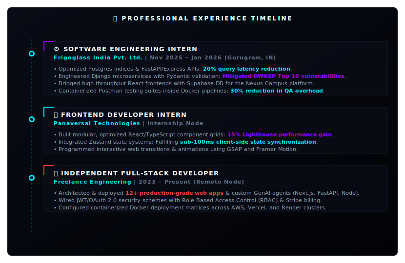

# Hi there, I'm Nitin! 👋

  <!-- Interactive Animated Cyberpunk Cockpit Header -->
  

 

> [!NOTE]
> ### ⚙️ COGNITIVE DIAGNOSTIC // NITIN YADAV
> **Full-Stack Software Engineer, AI/ML Researcher & Creative Coder** specializing in premium digital systems. I build secure backend APIs (FastAPI, Django, Node), optimize relational/document databases (Postgres, MongoDB, Supabase, Redis), and design high-fidelity frontends featuring 3D graphics, vector maps, and fluid micro-animations (Three.js, GLSL, GSAP, Framer Motion, Tone.js).

---

### 📡 Connection Terminals (Tac-Deck Buttons)

  <!-- Custom Tactile Contact Button Grid -->
  
  
  
  
   
  
  
  

---

### 🛠️ Systems & Architecture Matrix (Technical Skills)

  <!-- Dynamic 3-Column Cockpit Skills Dashboard -->
  

---

### 💼 Professional Experience & Timeline

  <!-- Custom Designed Glowing Timeline SVG -->
  

---

### 🚀 Highlighted Masterpieces (Featured Portfolios)

  <!-- 3D Shader Proposal (3D Web graphics, GLSL shaders, Tone.js, GSAP) -->
  
  
    
  
  <!-- Nexus Campus Super App -->
  
  
    

  <!-- AegisNet Cyber SOC -->
  
  
    
  
  <!-- WanderGlow AI Travel -->
  

---

### 📊 Git Telemetry & Activity Metrics

  <!-- Custom Offline Cockpit Stats SVG (Replaces unreliable third-party stats) -->
  

---

### 🎓 Academic Qualifications & Certifications
*   **VIT Bhopal University** — B.Tech in Computer Science Engineering (CSE Core) | **CGPA: 8.86 / 10.0** (2023 – 2027)
*   **CBSE Boards** — CBSE Class XII (PCM): 80.3% | CBSE Class X: 89.4%
*   **Google Cybersecurity Professional Certificate** — Network security, SIEM logs analysis, threat detection, Linux & SQL (2025)
*   **Google Generative AI Certification** — LLM alignment, prompt engineering, model application workflows (2025)
*   **Industrial IoT Markets & Security** — IoT architectures, cyber-physical threats, protocol security (2025)
