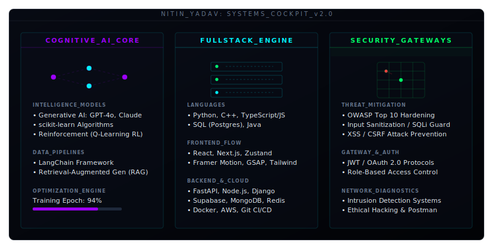
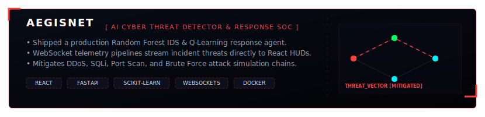
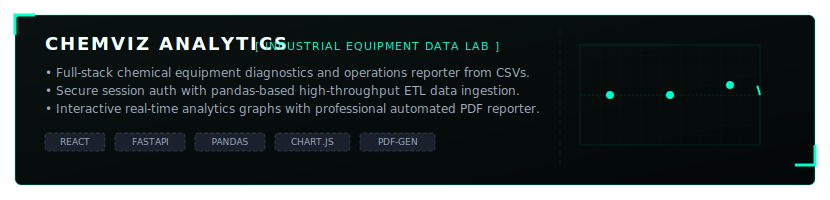

# Hi there, I'm Nitin! 👋

  <!-- Interactive Animated Cyberpunk Cockpit Header -->
  

 

### 👤 Profile Summary
Results-driven **Full-Stack Engineer** who has architected and shipped **12+ production-grade web applications** and **AI/ML systems** serving real users. My expertise spans secure, high-throughput backends (FastAPI, Node.js, Django) and database optimization (PostgreSQL, MongoDB, Redis) to fluid React frontends with sub-second loads. I specialize in **machine learning (LLM prompt engineering, RAG pipelines, scikit-learn)** and **application security (OWASP Top 10 mitigation, intrusion detection)**. 

---

### 🛠️ Systems & Architecture Matrix

  <!-- Dynamic 3-Column Cockpit Skills Dashboard -->
  

---

### 🚀 Selected Projects

  <!-- AegisNet Cyber SOC -->
  
  
    
  
  <!-- WanderGlow AI Travel -->
  
  
    
  
  <!-- ChemViz Analytics -->
  

---

### 📊 Git Analytics & Diagnostics

  <table border="0" cellpadding="0" cellspacing="0" width="100%">
    <tr>
      <td width="50%" align="center">
        
      </td>
      <td width="50%" align="center">
        
      </td>
    </tr>
  </table>

---

### 🎓 Certifications & Verification Links
*   **Google Cybersecurity Professional Certificate** — Network security, SIEM analysis, threat detection, Linux &amp; SQL (2025)
*   **Google Generative AI Certification** — LLM alignment, prompt engineering, model application workflows (2025)
*   **Industrial IoT Markets &amp; Security** — IoT architectures, cyber-physical threats, protocol security (2025)
*   **Verified Credly Badges** — Systems administration, networking protocols, security logs analysis, scripting automation

---

### 📫 Let's Connect!

  
  
  

