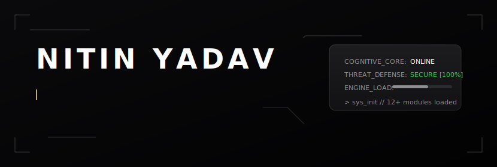
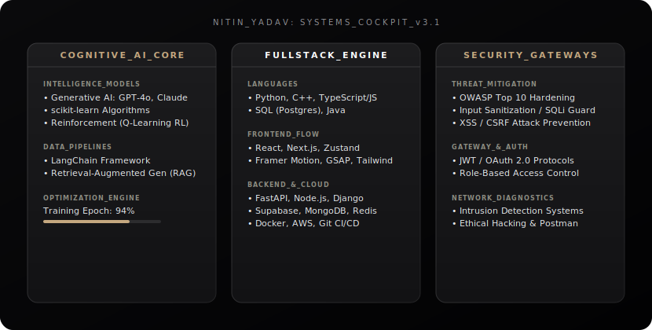
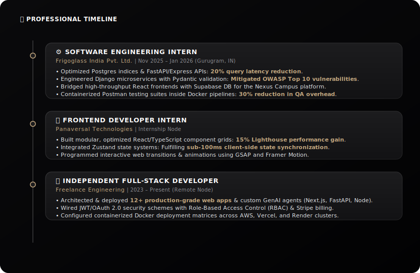
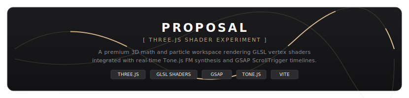
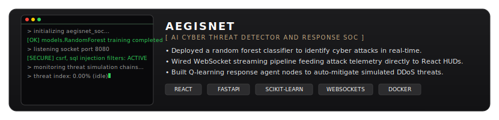
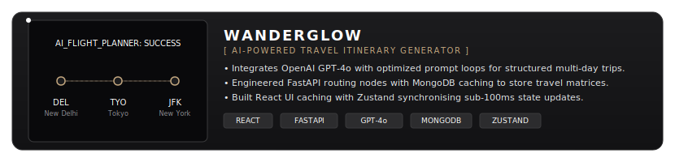
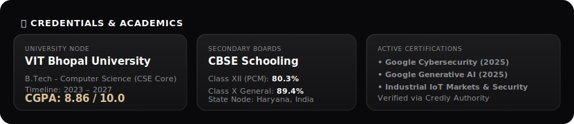

# Hi there, I'm Nitin! 👋

  <!-- Interactive Animated Cyberpunk Cockpit Header -->
  

 

> [!NOTE]
> ### ⚙️ SYSTEM SCAN // NITIN YADAV
> **Full-Stack Software Engineer, AI/ML Researcher & Creative Coder** dedicated to engineering high-performance, secure, and visually stunning digital products. I combine secure, production-grade backend logic (FastAPI, Django, Node) with fluid frontend telemetry and advanced 3D web graphics (Three.js, GLSL, GSAP, Framer Motion, Tone.js).

---

### 📡 Connection Terminals (Tac-Deck Buttons)

  <!-- Custom Tactile Contact Button Grid -->
  
  
  
  
   
  
  
  

---

### 🛠️ Systems & Architecture Matrix (Technical Skills)

  <!-- Dynamic 3-Column Cockpit Skills Dashboard -->
  

---

### 💼 Professional Experience & Timeline

  <!-- Custom Designed Glowing Timeline SVG -->
  

---

### 🚀 Highlighted Masterpieces (Featured Portfolios)

  <!-- Proposal (3D Web graphics, GLSL shaders, Tone.js, GSAP) -->
  
  
    
  
  <!-- Nexus Campus Super App -->
  
  
    

  <!-- AegisNet Cyber SOC -->
  
  
    
  
  <!-- WanderGlow AI Travel -->
  

---

### 📊 Git Telemetry & Activity Metrics

  <!-- Custom Offline Cockpit Stats SVG -->
  

---

### 🎓 Academic Qualifications & Certifications

  <!-- Custom Offline Academic Credentials SVG -->
  

